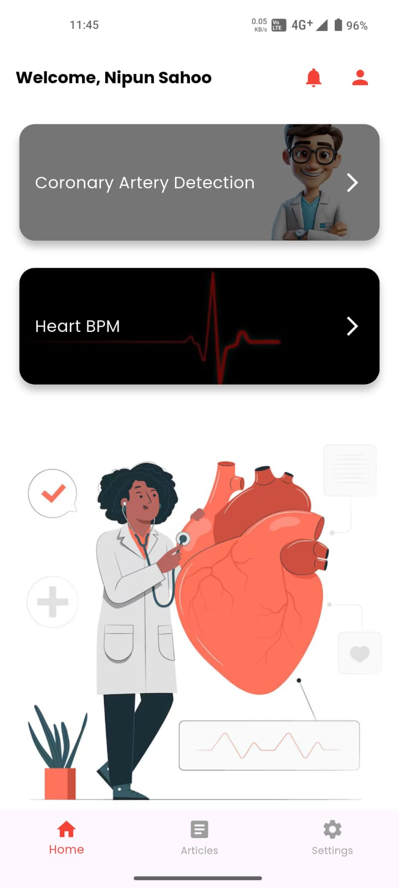

# HeartVision


AI-Powered Coronary Artery Calcification Detection App

## Getting Started

This project is a starting point for a Flutter application.

A few resources to get you started if this is your first Flutter project:

- [Lab: Write your first Flutter app](https://docs.flutter.dev/get-started/codelab)
- [Cookbook: Useful Flutter samples](https://docs.flutter.dev/cookbook)

For help getting started with Flutter development, view the
[online documentation](https://docs.flutter.dev/), which offers tutorials,
samples, guidance on mobile development, and a full API reference.
# HeartVision Flutter App

A Flutter app for coronary artery detection, enhanced with authentication and UI improvements.

## Features
- **Firebase Google Sign-In**: Secure authentication.
- **Animated UI**: Zoomed `heartgif.mp4` (scale: 1.5) in splash and login.
- **CAC Results**: Simulated coronary artery scores.
- **PDF Reports**: Generate and download 10 CAC reports.
- **Lottie Animations**: For upload and analysis.
- **Optimized UI**: Centered login with white background.

## Setup
1. Clone:
   ```bash
   git clone https://github.com/your-username/HeartVision-Flutter.git

2. Install:

   flutter pub get

3. Add Firebase:

   android/app/google-services.json
   lib/firebase_options.dart

4. Run:

   flutter run

*Requirements*

Flutter SDK: >=3.0.0
Firebase project
Assets in assets/

*Contributions*

Added Firebase Google Sign-In.
Integrated heartgif.mp4 with zoom.
Built CAC results and 10 PDF reports.
Optimized login UI and Android configs.

*Screenshots*

<p align="center">
  
  
</p>

